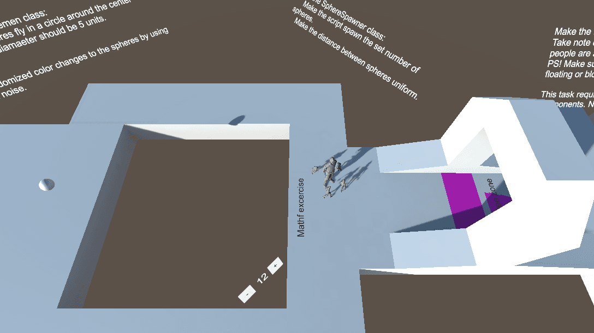

# Game Development Labs using Unity

UT Game Development Class Lab Practices. https://courses.cs.ut.ee/2020/gamedev/fall

## Game 1 - Flappy Bird

Deployed at: https://birdgame-brandon.surge.sh/

## Game 2 - Space Game

Labs 2 - 3

Deployed: https://spacegame-brandon.surge.sh/

## Game 3 - 3D tutorial (Components Task)

Instructions are written into the 3D world where you need to implement the behavior to get to the end.

## Game 4 - Project Setup

## Game 5 - Tower Defense

Labs 6 - 8

Deployed: tower-defense-brandon.surge.sh

## Lab 9 - Blender

## Lab 10 - Sounds

Press 1, 2, or 3 to play sounds. Sound is randomized to never be the exact same.

Deployed: sounds-brandon.surge.sh

## Lab 11 - Animations

Deployed: animation-brandon.surge.sh

## Lab 12 - Level Design

Deployed: lab12-brandon.surge.sh

## Lab 13 - Editor Extensions

## Lab 14 - Lighting

## Lab 15 - Procedural Generation

